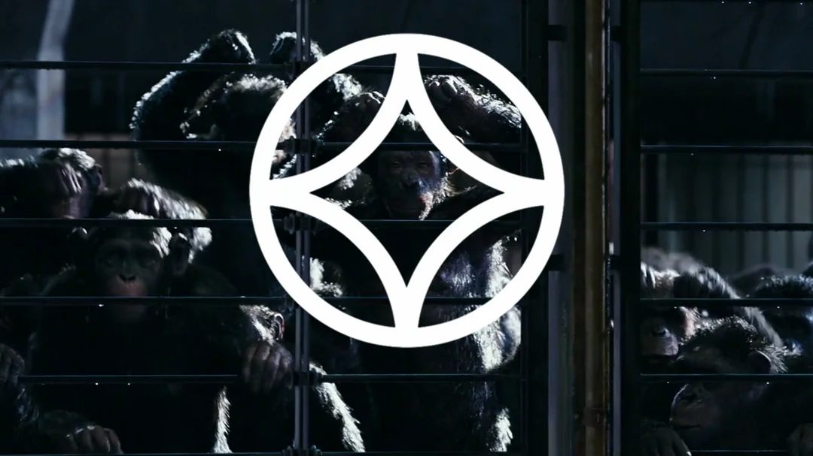

## My Professional Journey
I'm a **Systems and Computer Engineer**, a licensed professional engineer and an **AI software developer**. My work lives where **artificial intelligence meets real-world systems**: designing the platforms that let AI assistants work **safely and reliably** with the tools and data people depend on every day.

Most recently, I designed and built from the ground up an **AI platform based on the Model Context Protocol (MCP)**, and today I lead the team that carries it forward. It is a single core that takes care of what every integration needs (**identity, permissions, credentials and observability**), so new integrations can be switched on or off through configuration, with no redeployments. Every change that touches real data is **previewed and confirmed by a person** before it runs, and every action leaves a trace. I also build **AI-driven QA** that tries to break the system before anyone else does.

Before that, I built **data pipelines and BI dashboards** that turned hours of manual analysis into minutes, developed **RAG systems, computer vision and backend APIs** as a freelancer, taught **workshops and tutoring** in Python, IoT and machine learning, and started my career in **customer experience**, where I learned that technology only matters when it solves a real problem for someone.

## Your Friendly Neighborhood Software Engineer
Well, let's just say I'm your friendly neighborhood **software engineer.**

I'm not exactly a Spider-Man fan; however, **I love his catchphrase** and I have a special affection for **the Spider-Verse movies**.

To do the character justice (**and for having borrowed his catchphrase**), I'm going to point out one of those moments where **you learn to love Spider-Man**:

> ...But I handled it like a champion. 'Cause you know what? No matter how many times I get hit, I always get back up.
> 
> — <cite>Peter B. Parker[^1]</cite>

[^1]: [Spider-Man: Into the Spider-Verse (2018)](https://www.imdb.com/title/tt4633694/) | Animation, Action, Adventure. (2018, 14 diciembre). IMDb.



## About Me
My name is **Daniel Felipe Montenegro.**

By day, I'm a passionate **software developer** who loves to dive into code with the purpose of building solutions that impact people's everyday lives. By night? I’m exploring **cinema**, **music**, **literature** and a little bit of **poetry**; sometimes all at once, because all those things remind me that **I’m alive.**

> [Puss remembers his time with Kitty and Perrito]
> 
> The Big Bad Wolf: What's the matter? Lives flashing before your eyes?
> 
> Puss in Boots: No... just one. I'm done running.
> 
> — <cite>Puss in Boots: The Last Wish[^2]</cite>

[^2]: [Puss in Boots: The Last Wish (2022)](https://www.imdb.com/title/tt3915174/quotes/) - Quotes - IMDb. (s. f.). IMDb.



This site is a bit more than just a **personal diary** open to the world; it’s really a way to connect with you. Here, I share my **professional work, ideas, and thoughts.** Every now and then, a feeling slips out, but that’s part of the **creative process**... I’m always open to collaborating on initiatives that generate **positive change** for everyone, so stick around; there's always **something exciting happening.**

If you want to know something more about me, you should know that the **most important** thing for me in life **is my family** and never give up **being yourself**; always be honest to your core. I faithfully believe that **I must have the courage and strength** to fight for a safe world for the people I love, and for no one else to feel the pain that I once felt or was felt by the **people who came before me.**



Everything is an **ephemeral moment**, but that is what makes it beautiful and worthy of ***being appreciated***. Nothing is as **trivial** as it seems and when **we realize** all the things that had to **fall into place** to make this instant **possible**; we can live with **fascination** this beautiful experience ***that is life.***

## Caesar's window
Caesar's window is a hypocycloid that he draws while locked in captivity to **remember his home**. Later, the other apes will remember this symbol as a representation of Caesar and *his essence*.

Caesar from the Planet of the Apes trilogy is **my favorite fictional character**, and one with which I feel deeply identified. If I must confess, at this moment in my life, I feel like Caesar when he talks to Maurice and tells him, ***“Apes Together Strong”***, after joining several pieces of branches to demonstrate that **they are stronger together than alone**. I firmly believe in collaboration and teamwork; sometimes it seems that we can go faster alone, but I am sure that **together we can always go further**.

For these reasons, I decided to make Caesar's symbol **my personal symbol** as well, because I believe in others as much as I believe in myself, and because **I dream to be a great leader one day**. I prepare myself every day with all my efforts to be worthy of that dream and many others that I carry **in my heart**.

## Tit For Tat 
Among the many ideas that have shaped my way of thinking, few have **fascinated me** as much as the **Tit For Tat strategy**. Originally introduced by **Anatol Rapoport** in the competition organized **by Robert Axelrod in 1980**, it stands as the winning and emblematic strategy of the [Prisoner’s Dilemma](/tags/prisoners-dilemma), one of my favorite problems in **game theory**.


If you’re interested in learning more, I recommend watching the video titled [“What Game Theory Reveals About Life, The Universe, and Everything”](https://youtu.be/mScpHTIi-kM?si=4yu0qFeFhT4j2h1S) by Veritasium, which also has a [Spanish version](https://www.youtube.com/watch?v=vBgrvVY1jGo).


Tit For Tat relies on **two very simple rules** as its principle.
1. **Start by cooperating** as a gesture of goodwill toward the other.
2. **Mirror the opponent's last move,** regardless of whether they cooperated or not.

> Robert Axelrod identified **four success qualities** that contributed to the effectiveness of strategies:
> 1. **Nice:** Have good will and do not take advantage of your opponent.
> 2. **Forgiving:** Cooperate when necessary, even if you've been let down before.
> 3. **Retaliatory:** If your opponent defects, strike back immediately. Don't be a pushover
> 4. **Clear:** Be consistent with your strategy and actions.

Beyond its *theoretical elegance*, **Tit For Tat** is for me a life philosophy that invites me to apply these four success qualities *day by day*, **because real life is not a zero-sum game**, where in order to win, the other must necessarily lose (*as in chess*). Instead, **I hold on to the hope that where we all win, we also win ourselves**, so thank you for reading this; and don’t hesitate that in the future **we will be able to cooperate together not only to achieve a common good, but to achieve a general good**.

## My greatest ambition
*The best profession in the world:* **being a parent.** <cite>[^3]</cite>

[^3]: [Daniel Felipe Montenegro's thoughts](/thoughts)

## My favorite book
***Cien años de soledad***, by **Gabriel García Márquez**.

In the novel the **yellow butterflies** arrive before anyone can explain them. Nobody ever does.



They don't last. Reach one. Nothing holds them for long. Try anyway.

## Where can we be friends?
Keep in mind that **I don't use social networks, so you won't find me there.** 

Until recently I was using **X** as something similar to an open journal where I collected everything I learned... However, everything that is there **will end up being progressively integrated here (on my website)**; which will result in this being my unique and cozy place.

So, in the meantime, I invite you to be my friend on:

### Duolingo

## Contact Me
If you want to contact me, the easiest way is through **Telegram**. Alternatively, you can use my social links on the [home page](/).


Send a Message


## To be continued?
Definitely yes, and to continue, there are plenty of **related sections**:

- All my thoughts in [/thoughts](/thoughts).
- My music space in [/spaces/music](/spaces/music).
- My cinema space in [/spaces/cinema](/spaces/cinema).
- My sense of humor in [/spaces/comedy](/spaces/comedy).
- The story behind my YouTube channel in [/spaces/mi-amigo-melquiades](/spaces/mi-amigo-melquiades/).

**Want to see how things evolve?** Keep track of all the changes and updates on the site at [/changelog](/changelog).