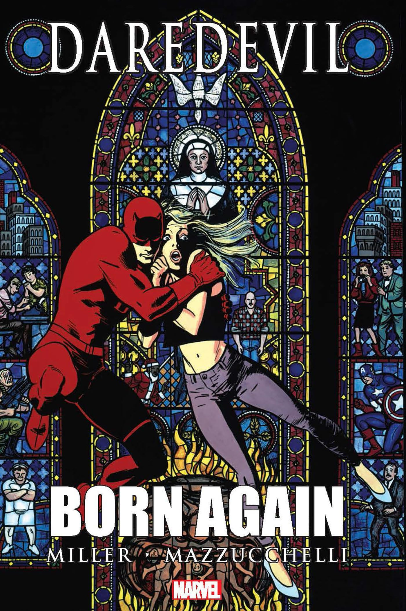

There is a **classic interview question** that I have always enjoyed: ***which superhero do you identify with, and how would you use those powers in your daily routine?*** It sounds like an icebreaker, but answering it honestly says a lot about **who you are** and **how you work**. This is my answer.

## A Hero or a Superhero?

I love cinema and its stories, so if the question had been about a **"hero"**, my choice would clearly have been one of these:

- **Caesar from the Planet of the Apes trilogy:** my favorite fictional character, and one I deeply identify with. If I must confess, at this moment in my life, I feel like Caesar when he talks to Maurice and tells him, “Apes Together Strong”, after joining several branches to show that they are stronger together than alone... [*Read the rest in **"Caesar’s window"***](/about/#caesars-window)
- **Puss in Boots (The Last Wish):** that movie touched my heart in an indescribable way; it made me love and fight even harder for my one and only life.

## A Superhero: Daredevil in *Born Again*

But the challenge was clear: **choose a superhero**. And when I stopped to think about which one I identify with, I realized it wasn't just about choosing a character, but about choosing ***a moment***. That's why I chose **Daredevil in *Born Again***.

Beyond its obvious layers of resilience, identity and faith, there are two lessons from this story that marked me deeply. Two ideas that, when I bring them into my personal and professional life, help me find meaning and direction even in difficult moments:

### The Illusion of Control

In *Born Again*, Matt Murdock loses everything: his job, his reputation, his home, his peace of mind. Everything he thought he had under control falls apart, and not because of a great epic battle, ***but because of a chain of small collapses***. It's devastating. But what moves me is that, even so, he doesn't give up. He doesn't become cynical or lose his moral compass. He chooses to rebuild himself from the ruins, with dignity, humility and courage. Not out of revenge or pride, but out of loyalty to what he believes in and to who he is.

That story reminds me of something we sometimes forget: much of what we believe we have **“under control”** (our plans, our careers, even our certainties) is fragile. And when things change ***(as they always do)***, the challenge is not to keep control, but to learn to let it go without losing your way.

At work, this means adapting when projects change, when something fails or doesn't turn out as expected. It means recognizing that I can't control every outcome, but I can choose how to respond: with honesty, calm and determination. I can rethink, learn, ask for help and keep building, **without losing who I am or what matters to me.**

> Oogway: My friend, the panda will never fulfill his destiny, nor you yours, until you let go of the illusion of control.
> 
> Shifu: Illusion?
> 
> Oogway: Yes. [points at peach tree]
> 
> Oogway: Look at this tree, Shifu. I cannot make it blossom when it suits me, nor make it bear fruit before its time.
> 
> Shifu: But there are things we *can* control. [kicks the tree so that peaches fall]
> 
> Shifu: I can control when the fruit will fall! [he slices a peach and throws the pit to the ground]
> 
> Shifu: I can control where to plant the seed! That is no illusion, Master!
> 
> Oogway: Ah, yes. But no matter what you do, that seed will grow to be a peach tree. You may wish for an apple or an orange, but you will get a peach.
> 
> — <cite>Kung Fu Panda (2008)[^1]</cite>

[^1]: [Kung Fu Panda (2008)](https://www.imdb.com/title/tt0441773/quotes/) - Quotes - IMDb. (s. f.). IMDb.

### Being Your Best Self, Even in Your Worst Moments

What I admire most about Matt Murdock in *Born Again* is that, even when he is on the ground, he doesn't betray himself. He doesn't harden himself to survive or change his essence just to **"win"**. On the contrary, he allows himself to fall, to feel, to stagger... and from that very place, he chooses to grow. ***He chooses to be better***.

That integrity (that willingness to evolve without losing what makes you authentic) is something I strive to practice every day. **It shows up in small but meaningful things:** in how I face frustration when something goes wrong, in how I treat my teammates under pressure, or in how I care about the quality of my work for the simple pleasure of doing something well (like [Zima Blue](/blog/zima-blue/)).

*For me, growing is not about forgetting your roots, but about honoring them. Just as the trees that reach for the sky never forget that their strength lies deep in the earth, I believe you can transform yourself and aspire to grow while staying true to who you really are.*
