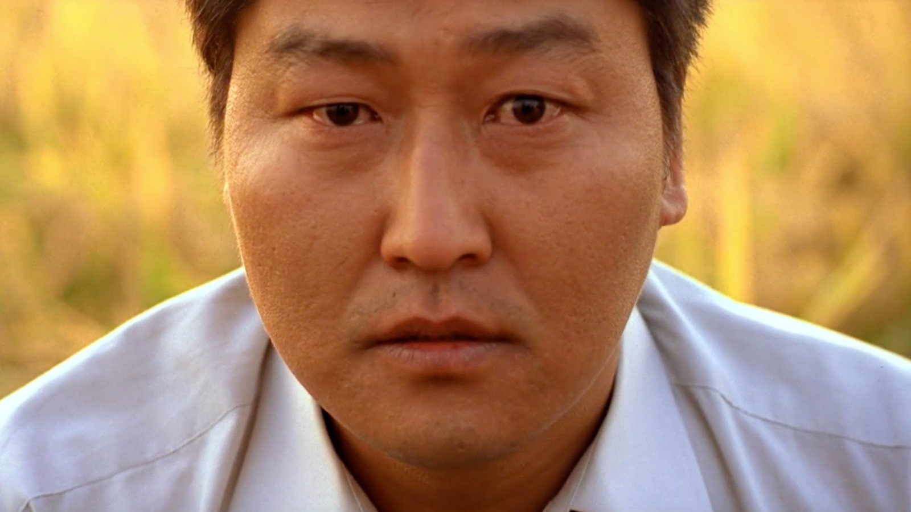

## English Translation

**Memories of Murder** is a film that **hurts deeply** and will remain **an open wound** in the heart of anyone who sees it. It not only raises uncomfortable questions but also compels us to share the **regrets and despair** of its characters. What makes this film tremendously special is **how authentic it feels**; each scene, each dialogue, reminds us that this story **could be happening** in any corner of the world, or may have **already happened**. This closeness to reality makes it profoundly terrifying, provoking **an overwhelming sense of helplessness**.

It is one of those films capable of marking **a before and after** for those who experience it. It has everything: moments of dark humor, touches of humanity, but always with **a shadow of fatality looming**. Sometimes, it seems to allow us to let our guard down, **giving us small respites**, only to hit us when we least expect it, and it is in those moments that **it plants itself deep within our consciousness**.

This is a work that **undoubtedly transcends genres**. Memories of Murder is not just a thriller or merely a police drama; ***it is a reflection on human nature, on injustice, and on the desperate search for answers in an indifferent world***. It does not seek to offer comfort or easy answers, and it is precisely this **uncertainty** that makes it an unforgettable experience. It is a film that leaves an indelible mark, **making you question the fragility of truth and the darkness that dwells within the human condition.**

**In the end, what remains is not the resolution of a crime, but the weight of helplessness and the scars that time does not erase.** Memories of Murder does not seek to close wounds but to open our eyes to a world where some questions **will never find answers.**

## Original in Spanish

**Memories of Murder** es una película que **duele demasiado**, y será **una herida abierta** para siempre en el corazón de quien la vea. No solo nos plantea preguntas incómodas, sino que nos lleva a compartir los **remordimientos y la desesperación** de sus personajes. Lo que hace a esta película tremendamente especial es **lo auténtica que se siente**; cada escena, cada diálogo, nos recuerda que esta historia **podría estar ocurriendo** en cualquier rincón del mundo, o que **ya sucedió**. Y esa cercanía con la realidad la convierte en algo profundamente aterrador, provocando **un abrumador sentimiento de impotencia**.

Es una de esas películas capaces de marcar **un antes y un después** en quien la experimenta. Tiene de todo: momentos de humor sombrío, toques de humanidad, pero siempre con **una sombra de fatalidad rondando**. A veces, parece que nos permite bajar la guardia, **dándonos pequeños respiros**, solo para golpearnos cuando menos lo esperamos, y es en esos momentos cuando **se siembra en lo más profundo de nuestra conciencia**.

Es una obra que, **sin duda, trasciende géneros**. Memories of Murder no es solo un thriller, ni solo un drama policial; **es una reflexión sobre la naturaleza humana, sobre la injusticia y sobre la búsqueda desesperada de respuestas en un mundo indiferente**. No busca ofrecer consuelo ni respuestas fáciles y es precisamente esa **incertidumbre** lo que la convierte en una experiencia inolvidable. Es una película que deja una marca indeleble, **que te deja cuestionando la fragilidad de la verdad y la oscuridad que habita en la condición humana**.

**Al final, lo que queda no es la solución de un crimen, sino el peso de la impotencia y las cicatrices que el tiempo no borra**. Memories of Murder no busca cerrar heridas, sino abrirnos los ojos a un mundo donde algunas preguntas **nunca encontrarán respuestas**.

