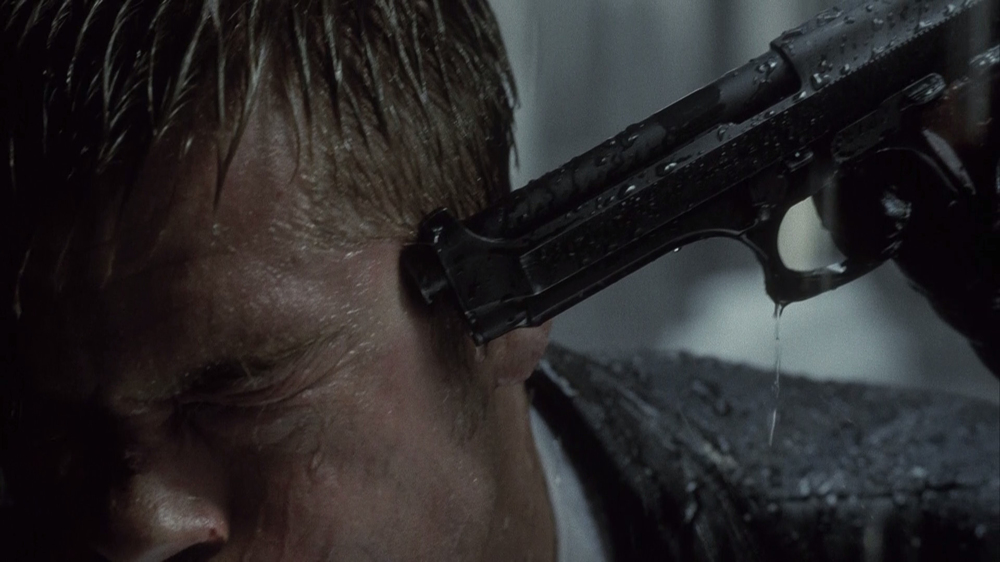
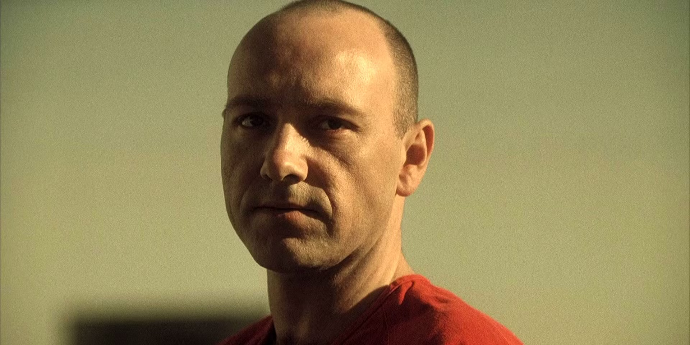
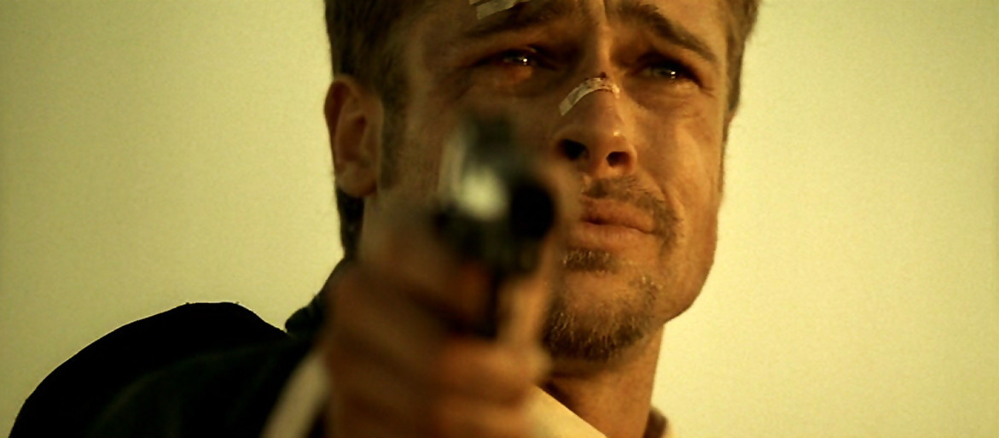
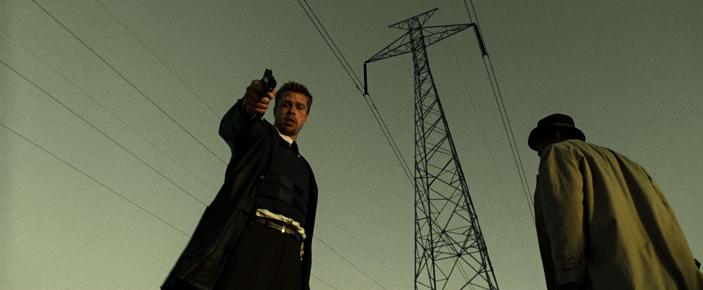

Every time I watch a movie, I’m passionate about feeling it and understanding it. Clearly, *Se7en* is not a film that leaves you indifferent. Kevin Spacey’s portrayal of John Doe is truly astonishing. Although his screen time is limited, every scene in which he appears has a profound impact, especially because as the end approaches, it becomes clear that everything was part of his plan: to be at that place at that exact time (evidenced by the delivery truck’s arrival). But what really captivated me about *Se7en* was the sense of having been led step by step to that inevitable outcome. As a viewer—even watching it 30 years later—I felt that I had reached the climax of the story only to discover that what awaited me was something completely different from what I had imagined: **a box**.

## The Key Moment
For me, the turning point of the film is when Detectives Somerset and Mills arrive at John Doe’s door and he attacks them. At that moment, we are told that he already knew them, which fits with the common behavior of criminals returning to the scene of their crimes. However, I believe that the reason John Doe doesn’t kill Mills immediately is that, in his sick logic, he considered that an immediate death was not a sufficient punishment for his sin.

But which sin am I talking about, and how did John Doe know it? This is where the scene in which the murderer disguises himself as a journalist and approaches the detectives gains significance. I don’t think this is simply a hint that he was always one step ahead (although he certainly was), but that day, upon witnessing the fury with which Mills expelled him from the crime scene, John Doe identified in him the perfect bearer of the sin of wrath. From that point on, his affinity for Mills grew—to the extent of sparing his life on their first encounter and later contacting him by phone. It wasn’t an act of indulgence or a cat-and-mouse game, but a deliberate choice: meeting Mills changed his plan, leading to the outcome we finally see.

## The Key Question
Perhaps up to this point everything seems logical, but the true question that left me thinking was not this. What really intrigues me is something deeper.

If we analyze John Doe’s pattern, beyond his philosophical justifications or his twisted purpose (which he explains during the journey to the desert when he talks about his mission and the corruption of the world), it essentially follows a clear scheme: he identifies a sinner, punishes them with a torture that matches their sin, and finally kills them. Following this logic, we can arrange the events in the following table:

| Sin      | Sinner             | Punishment                                  | Death |
| -------- | ------------------ | ------------------------------------------- | ----- |
| Gluttony | Obese man          | Forced to eat until he dies                 | Yes   |
| Greed    | Corrupt lawyer     | Mutilated to death                          | Yes   |
| Sloth    | Man in a coma      | Years of torture and malnutrition           | Yes   |
| Lust     | Prostitute         | Stabbed to death with a knife               | Yes   |
| Pride    | Vain woman         | Disfigured, forced into suicide             | Yes   |
| Envy     | John Doe           | Allows himself to be killed by Mills        | Yes   |
| Wrath    | Detective Mills    | Provoked to the point of losing control     | ?     |

Observing the table, there is an evident pattern: all the sinners die. But at the end of the film, there is a single exception: Detective Mills. Unlike the others, his punishment doesn’t immediately culminate in death, yet if we follow the logic of John Doe’s other crimes, his punishment is designed to lead him to a similar fate. This is where the big question arises:


**Does Mills die, or does he end up taking his own life?**


If we consider John Doe’s purpose, we can suppose that his plan was not only to manipulate Mills into killing him, but also to leave him with a psychological burden so unbearable that it would eventually lead him to self-destruction. This is hinted at in several scenes, such as Somerset’s warning about the brutality of the city and Mills’ vacant gaze at the end, which suggest that his suffering is only just beginning. This idea is reinforced by the notion presented at the beginning of the film, when Detective Somerset warns that the city’s brutality will be too much for Mills and that his decision to move there was a mistake.

## Conclusion
The ending of *Se7en* is one of the best representations of the psychological impact of violence, where the protagonists are dragged by extreme circumstances into a state of irreversible crisis. *Se7en* shows us how Mills becomes trapped in a spiral of despair from which he can hardly escape. John Doe not only achieved his immediate objective but also left Mills with an invisible yet deep wound—a seed of destruction that will grow within him, becoming an unbearable emotional burden that could consume him long after the credits have rolled. The film leaves us with an unsettling uncertainty: can Mills live with the weight of what he has experienced? Or, like all of John Doe’s other victims, will his final destiny also be death, consumed by the weight of his own sin?

