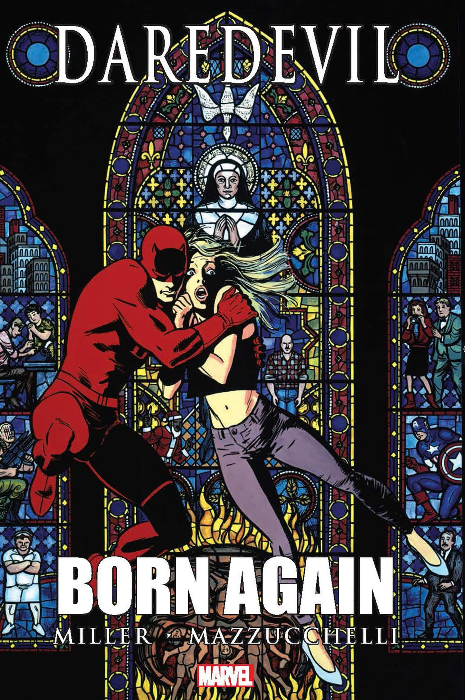
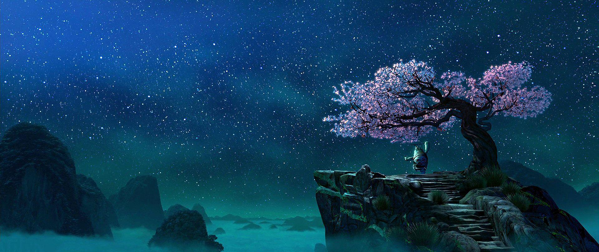

¡Mi nombre es **Daniel Felipe Montenegro** y quiero formar parte de los **GenOs de la sexta generación**!

Como parte de este camino, tengo el reto de presentarme al equipo de una manera innovadora, que les permita conocer más sobre quién soy y qué me apasiona. Por eso, creé esta página web para compartirla como parte de mi presentación.

## ¿Qué te gustaría que sepamos sobre ti?

Mi sitio web es un gran punto de partida, realmente es mucho más que un portafolio, es una especie de acogedor lugar personal donde, en mi tiempo libre me esfuerzo por recopilar las cosas que me apasionan y las que aprendo. Si quieres, puedes visitar los siguientes lugares:

- Un poco de quien soy en [/about](https://montenegrodanielfelipe.com/about/)
- Lo que me gusta escribir en [/blog](https://montenegrodanielfelipe.com/blog/)
- Mis proyectos y desarrollos en [/projects](https://montenegrodanielfelipe.com/projects/)
- Las cosas que ocupan mi tiempo en [/spaces](https://montenegrodanielfelipe.com/spaces/)

Si buscas lo suficientemente bien podrás encontrar fotos de mi familia, de mi infancia e incluso conocer a mi gatita ***"Kiki Softpaws"***, pero si la curiosidad por ella es aún mayor, puedes verla en [un video juntos](https://www.youtube.com/watch?v=iKpvrb9Xufw) donde nos presentamos juntos para una clase en tan solo 30 segundos. Ella incluso tiene una página web hecha por ella misma en [/kiki](https://montenegrodanielfelipe.com/kiki/). 

## ¿Con qué superpoder o superheroe te identificas y cómo usarías esas habilidades en tu rutina diaria?

### ¿Elegir un heroe o un superheroe?

Soy alguien que ama el cine y sus historias, claramente si hubiera dicho **"heroe"** hubiera hecho alguna de las siguientes elecciones:
- **Caesar from the Planet of the Apes trilogy:** es mi personaje de ficcion favorito, y con quien me siento profundamente identificado. Si he de confesarlo, en este momento de mi vida, me siento como César cuando habla con Maurice y le dice: “Simios juntos, fuertes”, después de unir varias ramas para demostrar que son más fuertes juntos que por separado... [*Lee el resto en **"Caesar’s window"***](https://montenegrodanielfelipe.com/about/#caesars-window)
- **Gato con botas (el último deseo):** Esa película tocó mi corazón de una forma indescriptible; me hizo amar y luchar aún más por mi única vida.

### Un superhéroe: "Daredevil: Born Again"

Pero el reto fue claro: **elegir un superhéroe**. Y cuando me detuve a pensar con cuál me identificaba, me di cuenta de que no se trataba solo de elegir un personaje, sino de elegir ***un momento***. Y por eso elegí a **Daredevil en *Born Again***.

Más allá de sus capas evidentes de resiliencia, identidad y fe, hay dos aprendizajes que me marcaron profundamente de esta historia. Dos ideas que, cuando las llevo a mi vida personal y profesional, me ayudan a encontrar sentido y dirección incluso en momentos difíciles:

#### La falsa sensación de control:
En *Born Again*, Matt Murdock lo pierde todo: su trabajo, su reputación, su hogar, su paz mental. Todo lo que creía tener bajo control se desmorona, y no por una gran batalla épica, ***sino por una cadena de pequeños derrumbes***. Es devastador. Pero lo que me conmueve es que, aun así, no se rinde. No se vuelve cínico ni pierde su brújula moral. Elige reconstruirse desde la ruina, con dignidad, humildad y coraje. No desde la venganza ni desde el orgullo, sino desde la fidelidad a lo que cree y a quien es.

Esa historia me recuerda algo que a veces olvidamos: que mucho de lo que creemos tener **“bajo control”** —nuestros planes, nuestras carreras, incluso nuestras certezas— es frágil. Y cuando las cosas cambian ***(como cambian siempre)***, el desafío no es mantener el control, sino aprender a soltarlo sin perder el rumbo.

En lo profesional, esto se traduce en saber adaptarme cuando los proyectos cambian, cuando algo falla o no sale como esperábamos. Es reconocer que no puedo controlar cada resultado, pero sí puedo elegir cómo responder: con honestidad, calma y determinación. Puedo replantarme, aprender, pedir ayuda y seguir construyendo, **sin perder quién soy ni lo que me importa.**

> Oogway: My friend, the panda will never fulfill his destiny, nor you yours, until you let go of the illusion of control.
> 
> Shifu: Illusion?
> 
> Oogway: Yes. [points at peach tree]
> 
> Oogway: Look at this tree, Shifu. I cannot make it blossom when it suits me, nor make it bear fruit before its time.
> 
> Shifu: But there are things we *can* control. [kicks the tree so that peaches fall]
> 
> Shifu: I can control when the fruit will fall! [he slices a peach and throws the pit to the ground]
> 
> Shifu: I can control where to plant the seed! That is no illusion, Master!
> 
> Oogway: Ah, yes. But no matter what you do, that seed will grow to be a peach tree. You may wish for an apple or an orange, but you will get a peach.
> 
> — <cite>Kung Fu Panda (2008)[^1]</cite>

[^1]: [Kung Fu Panda (2008)](https://www.imdb.com/title/tt0441773/quotes/) - Quotes - IMDb. (s. f.). IMDb.

#### Estar dispuesto a ser tu mejor versión, incluso en los peores momentos:
Lo que más admiro de Matt Murdock en *Born Again* es que, incluso cuando está en el suelo, no se traiciona. No se endurece para sobrevivir ni cambia su esencia solo para **"ganar"**. Al contrario, se permite caer, sentir, tambalear... y desde ese mismo lugar, elige crecer. ***Elige ser mejor***.

Esa integridad —esa disposición a evolucionar sin perder lo que te hace auténtico— es algo que me esfuerzo por practicar cada día. **Se manifiesta en cosas pequeñas pero significativas:** en cómo enfrento la frustración cuando algo no sale bien, en cómo trato a mis compañeros bajo presión, o en cómo cuido la calidad de mi trabajo por el simple placer de hacer una cosa bien hecha (como [Zima Blue](https://montenegrodanielfelipe.com/blog/zima-blue/)).

*Para mí, crecer no es olvidar tus raíces, sino honrarlas. Así como los árboles que buscan tocar el cielo no olvidan que su fuerza está en lo profundo de la tierra, creo que uno puede transformarse y aspirar a crecer sin dejar de ser fiel a quien realmente es.*
