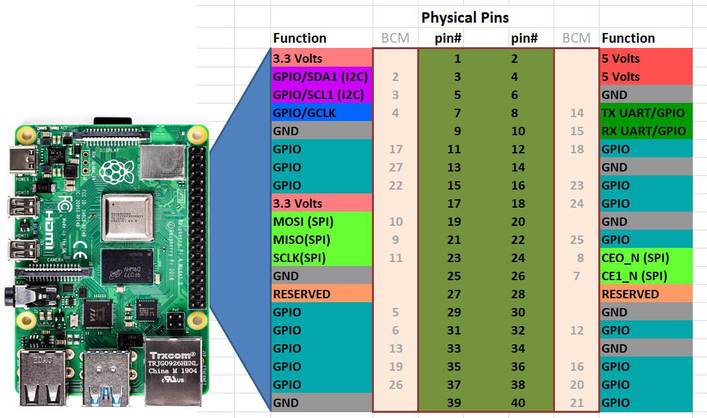



This is a practical introductory course created for the **Digital Technology** course at the **Universidad Nacional de Colombia**, highlighting the potential of **Single Board Computers (SBC)** such as the Raspberry Pi, where the true power of these devices is achieved through the coding process, which **unlocks their full capabilities**.

## Course Staff
- Professor: **Francisco Meluk Orozco**
- Engineer: **Ricardo Perdomo González**
- Student: **Daniel Felipe Montenegro**

## Location
- Building 411-103, **Microprocessors Laboratory**

## Step-by-Step Learning Plan (4 hours)

### Part 1: Foundations and Core Concepts (2 hours)

1. Introduction and Theoretical Concepts **(1 hour)**
   - The Origins of [Raspberry Pi](https://www.raspberrypi.com/news/bringing-computing-to-rural-cameroon/)
   - [Model Comparison](https://www.raspberrypi.com/documentation/computers/raspberry-pi.html)
   - Technical Specifications ([Hardware](https://www.raspberrypi.com/documentation/computers/processors.html#bcm2711) & [Software](https://www.raspberrypi.com/software/))
   - [Real-World Applications](https://www.cyberark.com/resources/threat-research-blog/cracking-wifi-at-scale-with-one-simple-trick) and [Interesting Projects](https://montenegrodanielfelipe.com/projects/pi-tensorflow-lite-object-detection/)
2. Remote Access and File Management **(30 minutes)**
   - Headless **SSH Connection**
   - **Transferring Files** and **Syncing Directories**
3. GPIO Basics and Digital I/O **(30 minutes)**
   - **BCM vs BOARD:** Pin Numbering in Raspberry Pi
   - Setting Up **GPIO for Output**
   - Setting Up **GPIO for Input**
   - **Essential GPIO Scripting:** The Importance of `.cleanup()`

## Remote Access and File Management

### Headless SSH Connection

In a **headless** setup, your Raspberry Pi runs without a monitor, keyboard, or mouse. Instead, you access it remotely using **SSH (Secure Shell)**, a protocol that provides an encrypted channel for secure communication between computers. This method is ideal for remote management and is considered **best practice**.

#### Windows and macOS:

Replace `user` with your actual **username** and `hostname.local` with the **Raspberry Pi's hostname**.

```bash
ssh user@hostname.local
```

To exit the SSH session, simply type: `exit` or press `Ctrl + D`

### Transferring Files and Syncing Directories

This step is **optional** but is provided in the workshop to simplify sending your code to the Raspberry Pi. A common tool for this task is `rsync`, which efficiently synchronizes files and directories **between your computer and the remote device**.

#### macOS and Windows (via Git Bash or Windows Subsystem for Linux):

```bash
rsync -avz --delete ./ user@hostname.local:/home/user/folder/
```

**IMPORTANT:**
- On macOS, `rsync` is installed **by default**.
- On Windows, if `rsync` is not available, you can install it using **Git for Windows (which provides Git Bash)** or enable the **Windows Subsystem for Linux (WSL)**.

If you prefer not to use rsync, you can also **manage files directly** on the Raspberry Pi with **terminal-based editors or viewers**.


## GPIO Basics and Digital I/O

### BCM vs BOARD: Pin Numbering in Raspberry Pi



Raspberry Pi offers two numbering systems for its GPIO pins:

- **BCM (Broadcom SOC Channel):** This method refers to the pin numbers based on the Broadcom chip. It is considered **best practice** and is typically the numbering printed on Raspberry Pi cases and accessories.
- **BOARD**: This method uses the physical pin layout on the Raspberry Pi header.

For consistency and compatibility with most accessories, it's recommended to use the **BCM** numbering system.

### Setting Up GPIO for Output
When controlling devices like LEDs, you configure a GPIO pin as an output. Instead of hardcoding a specific pin number, define a variable for flexibility.

**Example:**

```python
import RPi.GPIO as GPIO
import time

# Use BCM numbering mode (best practice)
GPIO.setmode(GPIO.BCM)

# Define the GPIO pin for the LED (replace with your desired pin number)
LED_PIN = 12

# Configure the pin for output
GPIO.setup(LED_PIN, GPIO.OUT)

# Toggle the LED on and off
GPIO.output(LED_PIN, GPIO.HIGH)
time.sleep(1)
GPIO.output(LED_PIN, GPIO.LOW)
time.sleep(1)
```

### Setting Up GPIO for Input
Configuring a GPIO pin as an input lets you read signals like button presses. You can also set up internal pull-up or pull-down resistors.

**Example:**
```python
import RPi.GPIO as GPIO

# Use BCM numbering mode (best practice)
GPIO.setmode(GPIO.BCM)

# Define the GPIO pin for the button (replace with your desired pin number)
BUTTON_PIN = 21

# Configure the pin as input with an internal pull-up resistor
GPIO.setup(BUTTON_PIN, GPIO.IN, pull_up_down=GPIO.PUD_UP)

# Check the button state
if GPIO.input(BUTTON_PIN) == GPIO.LOW:
    print("Button Pressed!")
else:
    print("Button Released!")
```

### Essential GPIO Scripting: The Importance of .cleanup()
To ensure that the GPIO pins are reset to a safe state after your script runs, always call `GPIO.cleanup()`. Using a `try finally` block guarantees that `GPIO.cleanup()` executes even if an error occurs during your script.

```python
import RPi.GPIO as GPIO
import time

# Use BCM numbering mode (best practice)
GPIO.setmode(GPIO.BCM)

# Define GPIO pins using variables
LED_PIN = 12       # Replace with your chosen output pin number
BUTTON_PIN = 21    # Replace with your chosen input pin number

try:
    # Setup for output and input
    GPIO.setup(LED_PIN, GPIO.OUT)
    GPIO.setup(BUTTON_PIN, GPIO.IN, pull_up_down=GPIO.PUD_UP)
    
    # Example: Toggle the LED
    GPIO.output(LED_PIN, GPIO.HIGH)
    time.sleep(1)
    GPIO.output(LED_PIN, GPIO.LOW)
    
    # Example: Check the state of the button
    if GPIO.input(BUTTON_PIN) == GPIO.LOW:
        print("Button Pressed!")
    else:
        print("Button Released!")
        
finally:
    # Ensure that GPIO.cleanup() is always called,
    # resetting the GPIO pins to their default state.
    GPIO.cleanup()
```

Using a `try finally` block is a good practice to ensure that **no matter what happens in your code**, the GPIO pins are always cleaned up properly.


## Prisoner’s Dilemma
Perhaps this is the most famous problem in game theory, which is fundamentally based on cooperation and where two subjects face the same dilemma of whether to cooperate or not, with the only certainty being that their subsequent reward or outcome will be closely related to the decision made by the other. This problem has different versions; however, for this project, we will use the **Symmetric 2×2 PD With Ordinal Payoffs** (explained in greater depth in the **Stanford Encyclopedia of Philosophy**) as exemplified in the table below:

|               | cooperate | defect |
| :-----------: | :-------: | :----: |
| **cooperate** |   B, B    |  D, A  |
|  **defect**   |   A, D    |  C, C  |

Always satisfying: **A>B>C>D**. For this project, the equivalences used were as follows: **A=5, B=3, C=1, D=0.** The resulting table is shown below:

|               | cooperate | defect |
| :-----------: | :-------: | :----: |
| **cooperate** |   3, 3    |  0, 5  |
|  **defect**   |   5, 0    |  1, 1  |

### "What Game Theory Reveals About Life, The Universe, and Everything" by Veritasium
If you're interested in learning more, I recommend watching the video titled ["What Game Theory Reveals About Life, The Universe, and Everything" by Veritasium](https://youtu.be/mScpHTIi-kM?si=4yu0qFeFhT4j2h1S), as well as the educational game created by [Nicky Case, "The Evolution of Trust"](https://ncase.me/trust/).




This video also has a [Spanish version](https://www.youtube.com/watch?v=vBgrvVY1jGo) available.



## Coursework: Assignments & Quizzes

### Quiz #1: LED Resistor Calculation
Calculate the appropriate resistor value for a red LED connected to a Raspberry Pi GPIO pin.

Ohm’s Law:  
$$
R = \frac{V_{source} - V_{LED}}{I}
$$

Use the following values:
  - Red LED Voltage Drop:  
    $$
    V_{LED} = 1.8V + \left(\frac{n}{k} \times 0.3V\right)
    $$
  - Current:  
    $$
    I = 9mA + \left(\frac{n}{k} \times 0.3mA\right)
    $$

Where \\( n \\) is the assigned group number and \\( k \\) is the total number of groups.

### Quiz #2: Finding the Raspberry Pi's Local IP
Use **SSH** to find the **local IP address** of the Raspberry Pi and take a screenshot as proof.

Provide screenshots of the following steps:
  1. The SSH command used to connect.
  2. The `ifconfig` command output.
  3. The `hostname -I` command output.

### Assignment #1: Prisoner's Dilemma Simulation
Develop a script that simulates the **Prisoner’s Dilemma** using **two RGB LEDs** and **two push buttons**—one for cooperation and one for defection.

The number of rounds is left to **your discretion**. However, a fixed number of rounds allows for **potential exploits**, which should be avoided. The system must support **multiple rounds**, but its duration should remain practical, as it will be reviewed in class. Excessively long runs **would be impractical**, so all design choices should prioritize **efficiency and feasibility**.

**Note:** *There is complete freedom in software design and pin selection. **The goal is to design and experiment to create the best possible Prisoner’s Dilemma simulation** using only two RGB LEDs and two push buttons.*
